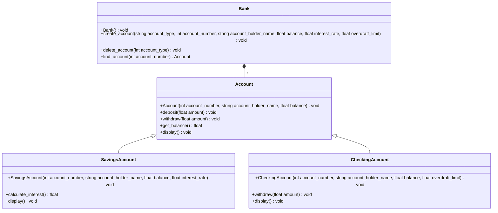

# UML Class Diagram

This is a UML class diagram for the relationship between `Bank`, `Account`, `SavingsAccount`, and `CheckingAccount`.

```mermaid
classDiagram
    class Bank {
        +Bank() void
        +create_account(string account_type, int account_number, string account_holder_name, float balance, float interest_rate, float overdraft_limit) void
        +delete_account(int account_type) void
        +find_account(int account_number) Account
    }
    class Account {
        +Account(int account_number, string account_holder_name, float balance) void
        +deposit(float amount) void
        +withdraw(float amount) void
        +get_balance() float
        +display() void
    }
    class SavingsAccount  {
        +SavingsAccount(int account_number, string account_holder_name, float balance, float interest_rate) void
        +calculate_interest() float
        +display() void
    }
    class CheckingAccount {
        +CheckingAccount(int account_number, string account_holder_name, float balance, float overdraft_limit) void
        +withdraw(float amount) void
        +display() void
    }
    Account <|-- SavingsAccount
    Account <|-- CheckingAccount
    Bank *-- "*" Account
```