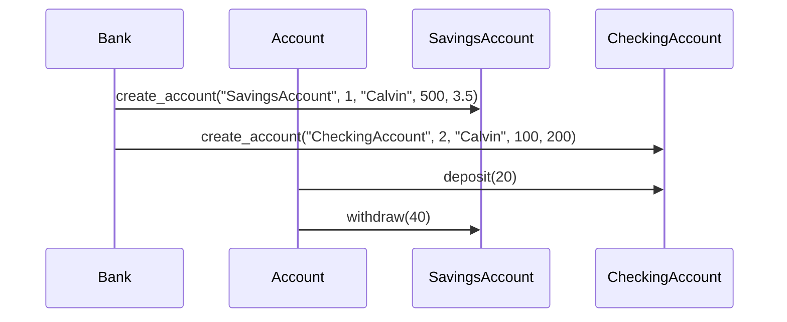

# UML Sequence Diagram

This is a UML Sequence Diagram that illustrates the interactions between the classes `Bank`, `Account`, `SavingsAccount`, and `CheckingAccount` for creating accounts, depositing to a `CheckingAccount`, and withdrawing from a `SavingsAccount`.

